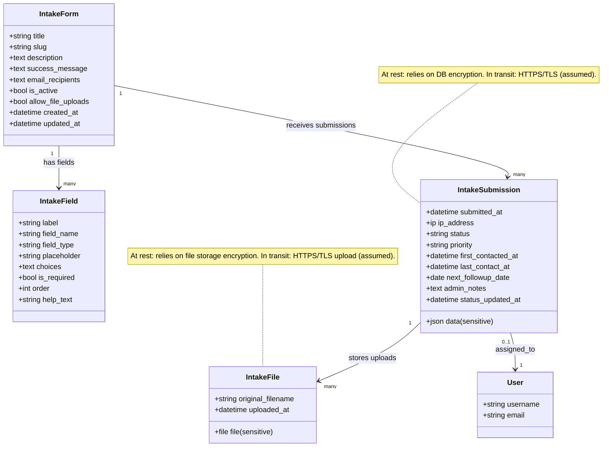
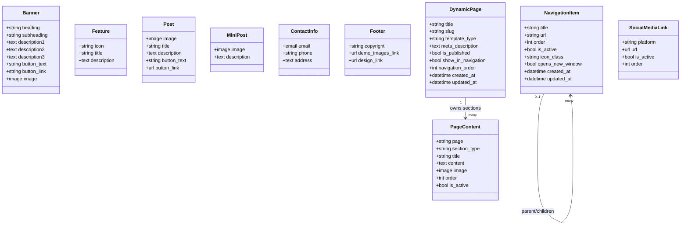
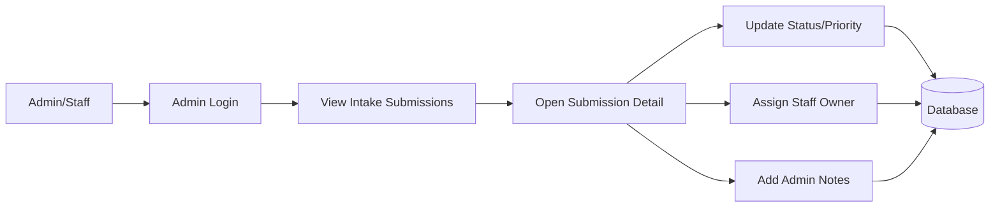
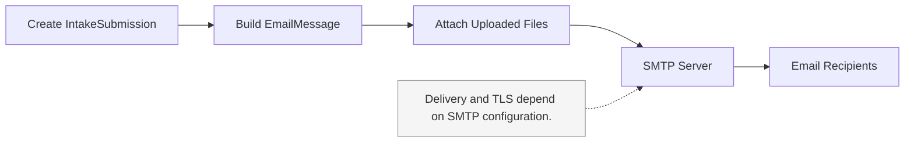

# Architecture Diagrams (Mermaid)

These diagrams reflect the current codebase as implemented in `main/models.py` and `main/views.py`.

Notes on security markings:
- The app does not implement field-level encryption. At-rest encryption depends on database/storage configuration.
- In-transit encryption depends on HTTPS/TLS and SMTP/TLS configuration in deployment.

## Intake Data Model (Submissions + Uploads)



## Content + Navigation Data Model



## Intake Form Submission Data Flow

```mermaid
flowchart LR
    user[User Browser] -->|HTTPS POST (assumed TLS)| intake_form[Intake form endpoint]
    intake_form --> validate[Validate required fields + email]
    validate -->|ok| save_submission[Create IntakeSubmission]
    validate -->|error| return_error[Return error message]

    save_submission --> save_files[Create IntakeFile records]
    save_submission --> send_email[Send email notification]

    save_files --> storage[(File storage)]
    save_submission --> db[(Database)]
    send_email --> smtp[SMTP service]

    admin[Admin/Staff] --> admin_ui[Admin UI]
    admin_ui --> db
    admin_ui --> storage

    note_sec[Transport security depends on HTTPS/TLS and SMTP TLS configuration in deployment.]:::note

    classDef note fill:#f5f5f5,stroke:#999,stroke-width:1px,color:#333;
    note_sec -.-> intake_form
    note_sec -.-> smtp
```

## Content Publishing Flow (Dynamic Pages)

```mermaid
flowchart LR
    editor[Admin/Staff] --> admin_ui[Admin UI]
    admin_ui --> create_page[Create/Update DynamicPage]
    admin_ui --> edit_sections[Create/Update PageContent]

    create_page --> db[(Database)]
    edit_sections --> db

    visitor[Site Visitor] --> request_page[Request /{slug}/]
    request_page --> page_view[dynamic_page_view]
    page_view --> db
    page_view --> render[Render template + page sections]
    render --> visitor
```

## Admin Workflow (Intake Review)



## Navigation Rendering Flow (Sidebar)

```mermaid
flowchart LR
    request[Page Request] --> context_proc[context_processors]
    context_proc --> nav_items[Fetch NavigationItem tree]
    context_proc --> dyn_pages[Fetch DynamicPage (show_in_navigation)]
    nav_items --> render_menu[Render base.html menu]
    dyn_pages --> render_menu
    render_menu --> response[HTML Response]
```

## Email Notification Path (Intake Submission)


